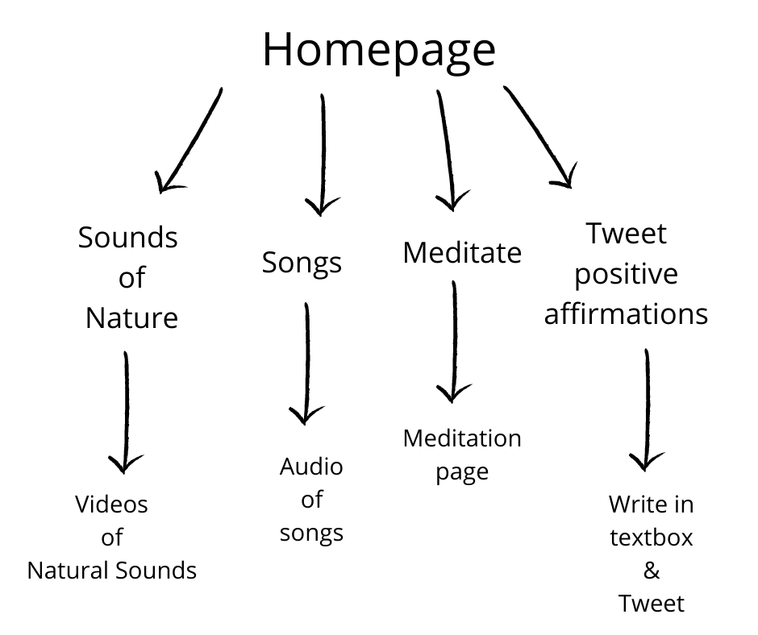
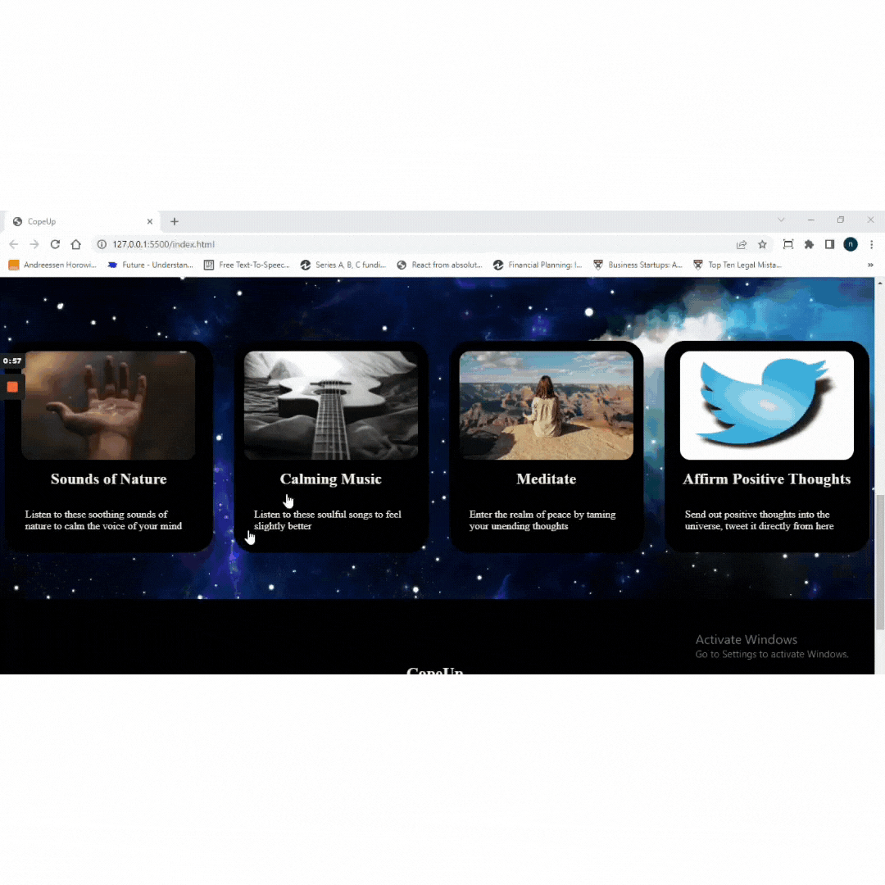
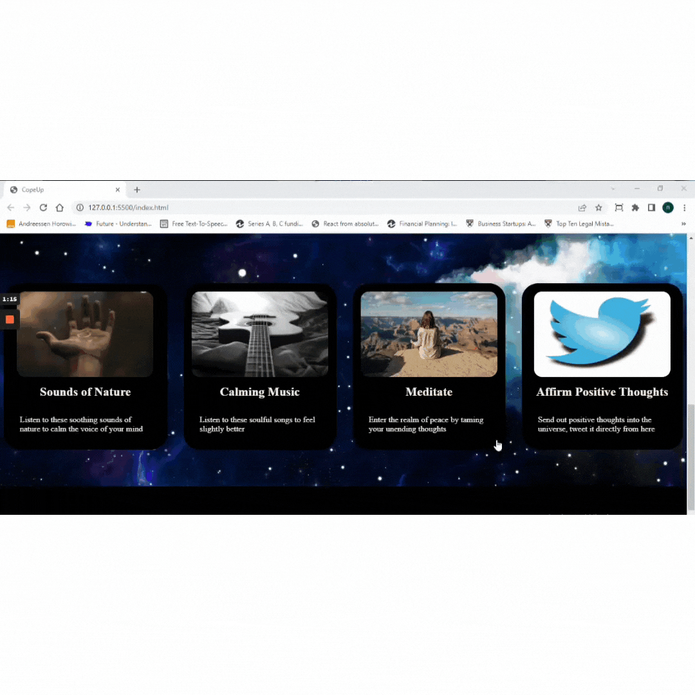

# CopeUp
An effort towards helping you cope with anxiety and stress

## Logo

## Problem Statement

Yound Indians generally face stress and anxiety due to studies, societal expectations, work load etc. This anxiety, if uncontrolled, can result in anxiety disorder in future. 

The problem with a lot of people is that they want to deal with their anxiety effectively but do not know where to start. Too much information available on the internet makes it difficult to stick to one solution. 

Our aim with this website is to allow people to spend 15-20 minutes every day and try any one or more of the stress relieving ways provided here.

## Why this Project?

Research suggests that some simple exercises such as listening to music or soothing sounds, meditation, positive affirmations etc can help tackle anxiety and stress to some extent. 

After talking to a lot of students and youngsters in India (online and offline) we realised that a lot of them need some help to deal with their anxiety and general stress. This website is a small effort towards the same. 

So, let's CopeUp!

## Author

- [@nikhatshaikh11](https://github.com/nikhatshaikh11)

## Tech Stack

HTML5

CSS3

JavaScript

## Features

- Listen to audio of peaceful songs
- Watch videos of soothing sounds of nature
- Meditation page
- Tweet positive affirmations

## User Flow

## Some GIFs of the website

Homepage:

Sounds of Nature:

Songs:

Tweet positive affirmations:

Meditate:

